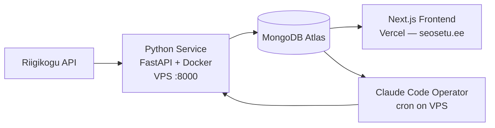

# Riigikogu Digital Twin

An AI-powered intelligence system that makes the Estonian Parliament legible, predictable, and accountable — collecting every vote, speech, and bill to model how 101 MPs actually behave.


## Demo

<!-- Screenshots will be added when the public dashboard launches -->

[Live site](https://seosetu.ee) (deployment in progress)

## Motivation

Parliamentary data in Estonia is public. The problem is that it is illegible. Over 4,000 voting records, in Estonian, scattered across API endpoints, with no structure a citizen can read. The information exists. The legibility does not.

A previous version of this system skipped legibility and jumped straight to prediction — achieving 73% accuracy, which is worse than the ~85% you get by simply guessing every MP votes with their party. Data leakage from LLM pre-training had inflated early results to 91.7% before honest evaluation revealed the real number. That failure was the most important discovery in the project's history.

This rebuild follows the arc: **Legible → Predictable → Accountable.**

**Legible.** Collect, structure, present. Raw API data becomes MP profiles, voting histories, party loyalty rates, attendance records, topic breakdowns. The parliament becomes readable. This is already valuable on its own.

**Predictable.** Statistics decide. Language models explain. Historical votes become features, features become forecasts from calibrated statistical models. The LLM never makes the prediction — it narrates it.

**Accountable.** Every prediction is timestamped, compared against reality, and published. The public accuracy dashboard is not a feature — it is the product.

## Features

- **MP Report Cards** — structured profiles with voting statistics, party loyalty rates, attendance, committee memberships, and AI-analyzed political positioning
- **Vote Prediction** — statistical models (logistic regression / XGBoost) that must beat the 85% party-line baseline to earn deployment; Claude explains predictions in both Estonian and English, but never makes them
- **Parliament Simulation** — enter a bill description, see predicted vote breakdown across all 101 MPs with passage probability
- **Public Accuracy Dashboard** — every prediction logged, resolved against reality, reported with no exceptions
- **Bilingual** — Estonian and English as equal citizens (next-intl)
- **Self-improving autonomy** — six interlocking feedback loops: Metabolic (data sync), Learning (retrain on new votes), Diagnostic (categorize failures), Planning (prioritize improvements), Pruning (remove stale data), and an Operator loop where Claude Code reads the system's diagnosis and modifies the source code itself

## Tech Stack

| Layer | Technology |
|-------|-----------|
| Backend | Python, FastAPI, APScheduler |
| Frontend | Next.js 14, TypeScript, Tailwind CSS |
| Database | MongoDB Atlas (vector search for embeddings) |
| AI | Claude Sonnet / Haiku (explanations), Voyage AI (embeddings) |
| ML Models | scikit-learn (logistic regression), XGBoost |
| UI | Radix UI (shadcn/ui), Recharts |
| i18n | next-intl (Estonian / English) |
| Deployment | Docker + VPS (service), Vercel (frontend) |
| Autonomy | Claude Code (self-modifying operator), APScheduler (loop heartbeats) |

## Architecture



**Three processes, one database, no coordinator.** The database is the coordination layer — each process reads the state of the world and acts accordingly (stigmergy, not orchestration).

- **Python service** (VPS, Docker): data pipeline, prediction model, learning loops, scheduling. Runs continuously. The nervous system.
- **Next.js frontend** (Vercel): presentation only. SSR pages, i18n, API proxy to Python. Stateless. The face.
- **Claude Code operator** (VPS, cron): reads system diagnosis from MongoDB, modifies the codebase to improve it, tests changes, deploys only if tests pass. The capacity for self-modification.

## Getting Started

### Prerequisites

- Python >= 3.11
- Node.js >= 18
- Docker & Docker Compose
- MongoDB Atlas account (free tier works)
- API keys: Anthropic, Voyage AI

### Installation

```bash
git clone https://github.com/Parlipuudja/riigikogu-digital-twin.git
cd riigikogu-digital-twin
```

### Running the service

```bash
cp .env.example .env
# Fill in: MONGODB_URI, ANTHROPIC_API_KEY, VOYAGE_API_KEY

docker compose up -d
# Service available at http://localhost:8000
# Verify: curl http://localhost:8000/health
```

### Running the frontend

```bash
cd frontend
npm install
npm run dev
# Available at http://localhost:3000
```

## Project Structure

```
├── SOUL.md                        # Philosophy and principles
├── SPECS.md                       # Technical blueprint
├── docker-compose.yml
├── vercel.json                    # { "rootDirectory": "frontend" }
│
├── service/                       # Python prediction service
│   ├── Dockerfile
│   ├── requirements.txt
│   ├── app/
│   │   ├── main.py                # FastAPI entry
│   │   ├── config.py              # pydantic-settings
│   │   ├── db.py                  # motor async MongoDB
│   │   ├── models.py              # Pydantic data models
│   │   ├── routers/               # health, predict, simulate, sync, backtest, data
│   │   ├── sync/                  # Riigikogu API client + Voyage AI embeddings
│   │   ├── prediction/            # baseline, features, model, calibrate, explain
│   │   └── tasks/                 # scheduler, resolve, diagnose, plan, operator
│   ├── prompts/                   # Claude Code operator templates
│   └── tests/
│
└── frontend/                      # Next.js app
    └── src/
        ├── app/
        │   ├── [locale]/          # i18n pages: dashboard, MPs, simulate, accuracy, about
        │   └── api/v1/            # Proxy routes → Python service
        ├── components/            # ui/, charts/, mps/, simulate/, layout/
        ├── lib/api.ts             # HTTP client → Python service
        ├── messages/              # et.json, en.json
        ├── i18n/                  # next-intl config
        └── types/domain.ts        # TypeScript mirrors of Python models
```

## What I Learned

These are not opinions. These are scars.

1. **Legibility before prediction.** The previous version skipped straight to forecasting and achieved 73%. You cannot model what you cannot read. Structure the data first.

2. **Data leakage flatters accuracy.** Pre-training contamination inflated results from 73% to 91.7%. Only post-cutoff evaluation is honest. This is the single most important integrity decision in the project.

3. **The baseline is the judge.** Party-line prediction gets ~85% for free. Any technique that doesn't beat this is waste — no matter how sophisticated.

4. **LLM confidence is a feeling, not a probability.** When Claude says "85% confident," that number is not calibrated. Use Platt scaling or isotonic regression for real probabilities.

5. **Autonomy is loops, not personas.** The v1 had operatives, a brain, a project manager persona, a guardian, a context directory tree. None of it did anything. A well-designed feedback loop with sense → compare → act outperforms any amount of organizational theater.

## Roadmap

- [x] Architecture design (SOUL.md + SPECS.md)
- [x] Python service skeleton — all modules, routers, prediction pipeline, autonomy tasks
- [x] Next.js frontend — all pages, components, i18n, API proxy
- [ ] Data sync from Riigikogu API validated end-to-end (Phase 1: Legibility)
- [ ] Baseline prediction beating 85% party-line on post-cutoff data (Phase 2: Prediction)
- [ ] Bilingual LLM explanations for every prediction (Phase 3: Explanation)
- [ ] All six autonomy loops running — including Claude Code operator (Phase 4: Autonomy)
- [ ] Public deployment at seosetu.ee (Phase 6: Deploy)
- [ ] Public accuracy dashboard with honest, verifiable track record

## Contributing

Contributions are welcome. Please read [SOUL.md](SOUL.md) first — it defines what this project believes and why. Open an issue to discuss before submitting a PR.

## Acknowledgments

- [Riigikogu Open Data API](https://api.riigikogu.ee) — the public data that makes this possible
- The v1 system and its 73% accuracy — the most important lesson
- Intellectual lineage: Unix philosophy (McIlroy), cybernetics (Wiener), requisite variety (Ashby), falsificationism (Popper), autopoiesis (Maturana & Varela), antifragility (Taleb)
