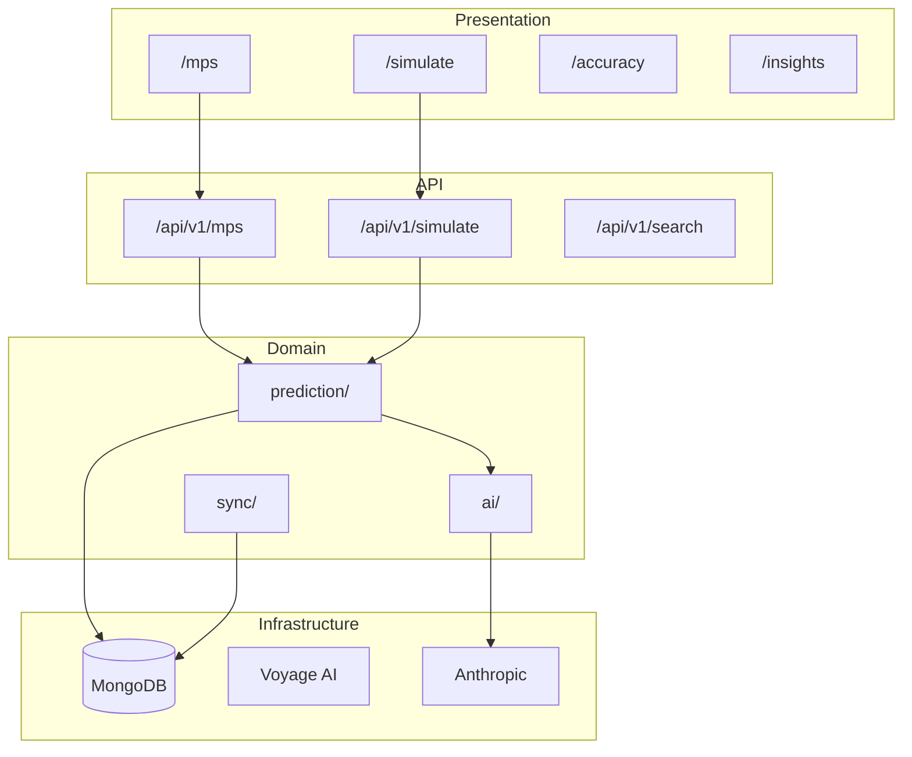

# Self-Documentation System Plan

## Vision

> An information ecosystem app should model exemplary information management about itself.

The Riigikogu Radar project will implement a **living documentation system** that automatically tracks, visualizes, and reports on its own architecture, features, and evolution.

## Goals

1. **Always-accurate documentation** - Auto-generated from code, not manually maintained
2. **Visual architecture maps** - Real-time system topology
3. **Feature tracking** - What exists, what's planned, what's deprecated
4. **Change detection** - Track evolution over time
5. **Health monitoring** - System self-awareness

---

## Architecture Components

### 1. Code Analysis Engine

```
┌─────────────────────────────────────────────────────────────────┐
│                    CODE ANALYSIS ENGINE                          │
├─────────────────────────────────────────────────────────────────┤
│                                                                  │
│  ┌──────────────┐    ┌──────────────┐    ┌──────────────┐       │
│  │ AST Parser   │───▶│ Dependency   │───▶│ Architecture │       │
│  │              │    │ Graph        │    │ Model        │       │
│  │ • TypeScript │    │              │    │              │       │
│  │ • React      │    │ • Imports    │    │ • Layers     │       │
│  │ • API routes │    │ • Exports    │    │ • Components │       │
│  └──────────────┘    │ • Calls      │    │ • Data flow  │       │
│                      └──────────────┘    └──────────────┘       │
│                                                                  │
│  Output: architecture.json (machine-readable system model)       │
└─────────────────────────────────────────────────────────────────┘
```

### 2. Feature Registry

```typescript
// src/lib/self-doc/feature-registry.ts

interface Feature {
  id: string;
  name: string;
  status: 'active' | 'beta' | 'deprecated' | 'planned';
  category: 'api' | 'ui' | 'data' | 'ai' | 'infra';
  description: string;
  files: string[];           // Files implementing this feature
  dependencies: string[];    // Other features this depends on
  metrics?: {
    usage?: number;          // API calls / page views
    errors?: number;
    latency?: number;
  };
  addedAt: Date;
  lastModified: Date;
}

// Auto-discovered from:
// - API routes (src/app/api/**/route.ts)
// - Pages (src/app/[locale]/**/page.tsx)
// - Scripts (scripts/*.ts)
// - Lib modules (src/lib/**/index.ts)
```

### 3. Architecture Visualizer

```
┌─────────────────────────────────────────────────────────────────┐
│                 ARCHITECTURE VISUALIZER                          │
├─────────────────────────────────────────────────────────────────┤
│                                                                  │
│  Input:  architecture.json                                       │
│  Output: Multiple visualization formats                          │
│                                                                  │
│  ┌─────────────────┐  ┌─────────────────┐  ┌─────────────────┐  │
│  │ ASCII Diagrams  │  │ Mermaid.js      │  │ Interactive     │  │
│  │                 │  │                 │  │ D3.js           │  │
│  │ • Terminal      │  │ • GitHub render │  │                 │  │
│  │ • Markdown      │  │ • Docs          │  │ • Web UI        │  │
│  │ • CLAUDE.md     │  │ • PRs           │  │ • Zoom/filter   │  │
│  └─────────────────┘  └─────────────────┘  └─────────────────┘  │
│                                                                  │
└─────────────────────────────────────────────────────────────────┘
```

### 4. Change Tracker

```
┌─────────────────────────────────────────────────────────────────┐
│                    CHANGE TRACKER                                │
├─────────────────────────────────────────────────────────────────┤
│                                                                  │
│  Git Integration:                                                │
│  • Track file changes per commit                                 │
│  • Map changes to features                                       │
│  • Detect architectural shifts                                   │
│                                                                  │
│  Timeline View:                                                  │
│  ┌───────────────────────────────────────────────────────────┐  │
│  │ Feb 1  │ Feb 2  │ Feb 3  │ Feb 4  │ Feb 5  │              │  │
│  │        │        │        │        │        │              │  │
│  │ ●──────┼────────┼────────┼────────┼────────┼─▶ API v1     │  │
│  │        │ ●──────┼────────┼────────┼────────┼─▶ Multi-AI   │  │
│  │        │        │ ●──────┼────────┼────────┼─▶ Backtest   │  │
│  │        │        │        │ ●──────┼────────┼─▶ Self-doc   │  │
│  └───────────────────────────────────────────────────────────┘  │
│                                                                  │
│  Generates: CHANGELOG.md (auto-updated)                          │
│                                                                  │
└─────────────────────────────────────────────────────────────────┘
```

---

## Implementation Plan

### Phase 1: Foundation (Week 1)

**Goal:** Basic code analysis and feature discovery

| Task | Description | Output |
|------|-------------|--------|
| 1.1 | Create AST parser for TypeScript | `scripts/analyze-codebase.ts` |
| 1.2 | Build dependency graph extractor | `src/lib/self-doc/deps.ts` |
| 1.3 | Implement feature discovery | `src/lib/self-doc/features.ts` |
| 1.4 | Generate architecture.json | JSON model file |

```bash
# Usage after Phase 1:
npx tsx scripts/analyze-codebase.ts
# Output: docs/generated/architecture.json
```

### Phase 2: Visualization (Week 2)

**Goal:** Multiple output formats for architecture

| Task | Description | Output |
|------|-------------|--------|
| 2.1 | ASCII diagram generator | Terminal/markdown output |
| 2.2 | Mermaid.js generator | GitHub-compatible diagrams |
| 2.3 | API endpoint for live data | `/api/v1/architecture` |
| 2.4 | Architecture page in UI | `/architecture` page |

```bash
# Usage after Phase 2:
npx tsx scripts/visualize-architecture.ts --format=ascii
npx tsx scripts/visualize-architecture.ts --format=mermaid
```

### Phase 3: Change Tracking (Week 3)

**Goal:** Track evolution over time

| Task | Description | Output |
|------|-------------|--------|
| 3.1 | Git history analyzer | Commit-to-feature mapping |
| 3.2 | Architecture diff tool | Detect structural changes |
| 3.3 | Auto-update CHANGELOG | `CHANGELOG.md` |
| 3.4 | Timeline visualization | Feature evolution view |

### Phase 4: Integration (Week 4)

**Goal:** Make self-documentation part of workflow

| Task | Description | Output |
|------|-------------|--------|
| 4.1 | Pre-commit hook | Validate architecture consistency |
| 4.2 | CI/CD integration | Auto-generate docs on deploy |
| 4.3 | CLAUDE.md auto-update | Keep AI context current |
| 4.4 | Health dashboard | System self-awareness page |

---

## File Structure

```
riigikogu-radar/
├── src/
│   ├── lib/
│   │   └── self-doc/
│   │       ├── analyzer.ts       # AST parsing and analysis
│   │       ├── features.ts       # Feature registry
│   │       ├── deps.ts           # Dependency graph
│   │       ├── visualizer.ts     # Output generators
│   │       └── tracker.ts        # Change tracking
│   └── app/
│       ├── api/v1/
│       │   └── architecture/
│       │       └── route.ts      # Live architecture API
│       └── [locale]/
│           └── architecture/
│               └── page.tsx      # Visual architecture page
├── scripts/
│   ├── analyze-codebase.ts       # Generate architecture.json
│   ├── visualize-architecture.ts # Generate diagrams
│   └── update-docs.ts            # Update all documentation
├── docs/
│   ├── generated/
│   │   ├── architecture.json     # Machine-readable model
│   │   ├── architecture.md       # Human-readable summary
│   │   ├── features.md           # Feature catalog
│   │   └── api-reference.md      # Auto-generated API docs
│   └── ARCHITECTURE.md           # Main architecture doc
└── CHANGELOG.md                  # Auto-updated changelog
```

---

## API Design

### GET /api/v1/architecture

Returns the current system architecture model.

```json
{
  "success": true,
  "data": {
    "version": "1.0.0",
    "generatedAt": "2026-02-03T12:00:00Z",
    "layers": {
      "presentation": {
        "pages": [...],
        "components": [...]
      },
      "api": {
        "routes": [...],
        "middleware": [...]
      },
      "domain": {
        "services": [...],
        "types": [...]
      },
      "infrastructure": {
        "database": [...],
        "external": [...]
      }
    },
    "features": [...],
    "dependencies": {
      "internal": [...],
      "external": [...]
    },
    "metrics": {
      "totalFiles": 156,
      "totalLines": 12450,
      "apiRoutes": 15,
      "pages": 8
    }
  }
}
```

### GET /api/v1/architecture/diff?from=<commit>&to=<commit>

Returns changes between two versions.

### GET /api/v1/features

Returns the feature registry.

---

## Visualization Examples

### ASCII Output (for CLAUDE.md)

```
┌─────────────────────────────────────────────────────────────┐
│                    RIIGIKOGU RADAR v1.0                     │
│                   Auto-generated 2026-02-03                 │
├─────────────────────────────────────────────────────────────┤
│                                                             │
│  PRESENTATION LAYER (8 pages, 24 components)               │
│  ├── /mps           MP profiles and list                   │
│  ├── /simulate      Parliament simulation                  │
│  ├── /accuracy      Prediction accuracy                    │
│  ├── /insights      Story leads                            │
│  └── /architecture  System architecture (this!)            │
│                                                             │
│  API LAYER (15 routes)                                     │
│  ├── /api/v1/mps/*         MP operations                   │
│  ├── /api/v1/simulate/*    Simulation engine               │
│  ├── /api/v1/search        Natural language                │
│  └── /api/v1/architecture  Self-documentation              │
│                                                             │
│  DOMAIN LAYER                                              │
│  ├── prediction/   Vote prediction + RAG                   │
│  ├── ai/           Multi-provider abstraction              │
│  ├── sync/         Riigikogu API integration               │
│  └── self-doc/     This system                             │
│                                                             │
│  INFRASTRUCTURE                                            │
│  ├── MongoDB Atlas    Document storage                     │
│  ├── Voyage AI        Vector embeddings                    │
│  └── Vercel           Hosting + Edge                       │
│                                                             │
│  STATS: 156 files | 12,450 lines | 89% MVP complete        │
└─────────────────────────────────────────────────────────────┘
```

### Mermaid Output (for GitHub)



---

## Success Metrics

| Metric | Target |
|--------|--------|
| Documentation accuracy | 100% (auto-generated) |
| Update latency | <5 min after deploy |
| Coverage | All API routes, pages, and features |
| Format availability | ASCII, Mermaid, JSON, UI |

---

## Benefits

1. **For Claude AI:** Always-accurate context in CLAUDE.md
2. **For Developers:** Self-documenting codebase
3. **For Users:** Transparency about system capabilities
4. **For Journalists:** Understand the tool they're using
5. **Meta-value:** Information ecosystem practicing what it preaches

---

*Plan created: 2026-02-03*
*Status: Ready for implementation*
